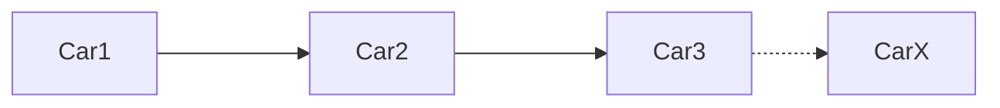
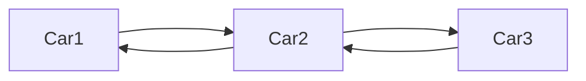
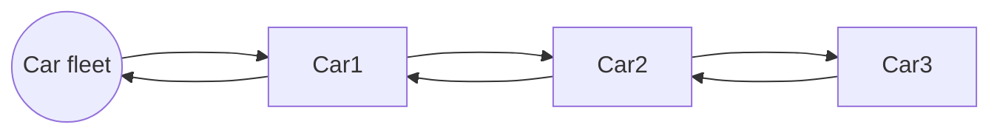
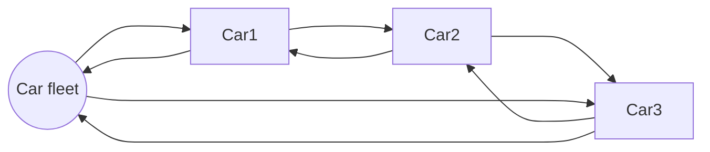

---
Object oriented programming brings many new patterns to PLC programming. Today I want to talk about one of them: **Linked lists**.

## Intro
Many times during programming you come to a problem where you want to go over all instances of a specific function block and change a property or call a method. Let's say we have a parking full of cars, and we want to lock them all. Without OOP technics you are stuck with some piece of code in all instances that is triggered by a shared variable (global or static). Every car polls the trigger, and locks when the trigger becomes high. As complexity increases, the code will become more and more a real spaghetti monster.  

A cleaner way is to create an array with a pointer/reference/interface to all function blocks, and have the program iterate over each element.     
Here is a simple example for a car instance list:
```iecst
VAR_GLOBAL
	aCarList:	ARRAY [0..2] OF ITF_Car := [
                            MAIN.fbRedCar,
                            MAIN.fbGreenCar,
                            PRG1.fbMyCar
                        ];
END_VAR
```
The programmer is responsible for maintaining the list. If he adds a car somewhere in the program he needs to add it to the list, otherwise it wont be locked together with the other cars.    
You can see that this mistakes will easily happen the more cars are used and the bigger the parking becomes. A more advanced programmer would let the cars use `FB_init` to register themself to the list. You can find an example of this in the famous [TcUnit](https://github.com/tcunit/TcUnit) framework. Where the function block pointer of a *testsuit* is automatically added to a global list:

```iecst
METHOD FB_init : BOOL
VAR_INPUT
    bInitRetains : BOOL;
    bInCopyCode : BOOL;
END_VAR
```
```iecst
GVL_TcUnit.NumberOfInitializedTestSuites := GVL_TcUnit.NumberOfInitializedTestSuites + 1;    
GVL_TcUnit.TestSuiteAddresses[GVL_TcUnit.NumberOfInitializedTestSuites] := THIS;
```
As memory allocation is static in the Plc, array size is also fixed. (I'm ignoring the `__NEW` operator here.) That's why this implementation needs to define a maximum size to reservates an array which can hold enough elements for the application. If you go over that size, you will have problems.    
    
A last point to take into account is that online changes can add, move and remove instances. The code should be able to handle this. References and pointers can become invalid after an online change, while interfaces are automatically adapted by TwinCAT.

## Linked list
With a [linked list](https://en.wikipedia.org/wiki/Linked_list), as the name implies, you link all instances with each other. A car will know the location of the next car, and that car again knows where to find the next car, and so on. 

In a double linked list, instance don't only know the next instance, but also the previous instance.

A sentinel node, is dummy node that is added to the beginning or end to make sure there is always a node available even if the list is empty. I prefer to call this the *master* node.

It is also possible to make the list a circle. And because the handling of adding and removing nodes is easier this way, we are going to build a *"Double circular linked list with a sentinel node"*.


---

### - Design
To make it clearer what we are going to build, a list of design choises are listed here:    
    
**Node**
* Double linked: When a node gets removed, it glues both sides together to restore the link.
* Keeps a direct link to the master node. It makes many operations more easy and faster.    

**Master node**
* Always available even if the list is empty.
* Keeps track of the list size. Because of this, we only allow the master to remove or add nodes.
* Keeps a link to the last accessed node, this can make iterating over the list easier.
* By linking the last node to the master node (=circular), it becomes trivial to add a new node to the end of the list.    

**Linking**
* The linking will be done with interfaces as they survive online changes with memory reallocation.

### - Node implementation
We start by defining the basic node interface that both the normal and master node will implement.
