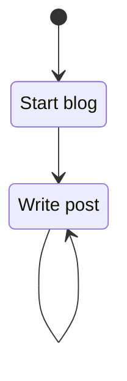

---

Here we are, with the first post on this blog. By the time this post goes online, I will have learned a lot about creating a blog. The first step can be the hardest, but once you take it, things will get easier.

## Why

My initial intention is to use this blog to share experiences and knowledge with people who are interested in anything related to automation and software development. It will come in the form of "wist-je-datjes", a Dutch term my colleagues used to notify that they found an interesting feature or use case. You could translate this term to something like "did-you-know-this". Most posts will be about TwinCAT and LabVIEW, as these are the environments I have used the most during my professional work. At some point, I will also use this blog to talk about side and hobby projects that I have built in the past (and future).

## Blog backend
By using GitHub Pages with [Jekyll](https://jekyllrb.com/), it's possible to create a blog without the need for a dedicated server.
The tutorial from [Bill Raymond](https://github.com/BillRaymond/my-jekyll-docker-website) was a perfect starting point. It goes into detail on how to set up a Docker container for local testing.


I chose to use the [Chirpy](https://github.com/cotes2020/jekyll-theme-chirpy) Jekyll theme, as it has a clean design that includes the basic features I need.

It has mathematics powered by [MathJax](https://www.mathjax.org/):

$$ x = {-b \pm \sqrt{b^2-4ac} \over 2a} $$

Cool charts are also possible with the help of a [Mermaid](https://mermaid.js.org/):


	
Highlighting tips and warnings, *no problemo*:
> This warning is not for you!
{: .prompt-warning }


To support syntax highlighting for `structured text`, the built-in highlighter needs to be replaced with [highlight.js](https://highlightjs.org/) and the [iec-st](https://github.com/highlightjs/highlightjs-structured-text) extension. Don't ask me how I did it, as I just [tweaked](https://jojozhuang.github.io/tutorial/jekyll-highlighting/) it until it worked. I bet it will break in the future, as web design is something I can do but don't know how to do correctly.

```iecst
//Structured text
IF xTest THEN
    fbTest.doThing();
    myVar := 2.5;
END_IF
```

```javascript
//Javascript
if( 5==3 ){
    console.log("Test");
}
```

```yaml
#YAML
--- # The Smiths
- {name: John Smith, age: 33}
- name: Mary Smith
  age: 27
- [name, age]: [Rae Smith, 4]   # sequences as keys are supported
--- # People, by gender
men: [John Smith, Bill Jones]
women:
  - Mary Smith
  - Susan Williams
```

Finish it off with a picture of my thought flow:

_Moore curve by Bram Gurdebeke under [CC BY 4.0](https://creativecommons.org/licenses/by/4.0/)_

> "And we have everything at our disposal to create some interesting articles!"

Last but not least, let's hope that when this is pushed to the GitHub page, the comment section powered by [giscus](https://giscus.app/) works. (Edit: It didn't. Because [someone](https://github.com/Hopperpop/Hopperpop.github.io/commit/00cf0e37b7aebf92d53c885d1ba1b8b59e6bc5a7) can't spell that well.)