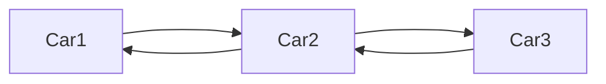
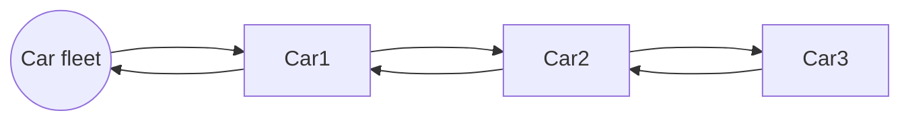
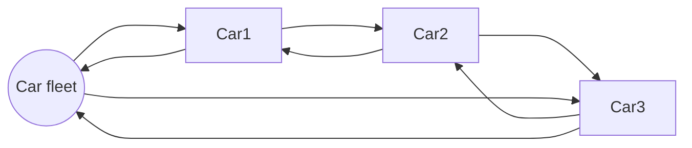

---
Object oriented programming brings many new patterns to PLC programming. Today I want to talk about one of them: **Linked lists**.

Because the length of the post was getting to long, it's split in 3 parts:
* Part 1 - Intro and node implementation
* Part 2 - Master node implementation
* Part 3 - Example usecase

## Intro
Many times during programming you come to a problem where you want to go over all instances of a specific function block and change a property or call a method. Let's say we have a parking full of cars, and we want to lock them all. Without OOP technics you are stuck with some piece of code in all instances that is triggered by a shared variable (global or static). Every car polls the trigger, and locks when the trigger becomes high. As complexity increases, the code will become more and more a real spaghetti monster.  

A cleaner way is to create an array with a pointer/reference/interface to all function blocks, and have the program iterate over each element.     
Here is a simple example for a car instance list:
```iecst
VAR_GLOBAL
	aCarList:	ARRAY [0..2] OF ITF_Car := [
                            MAIN.fbRedCar,
                            MAIN.fbGreenCar,
                            PRG1.fbMyCar
                        ];
END_VAR
```
The programmer is responsible for maintaining the list. If he adds a car somewhere in the program he needs to add it to the list, otherwise it wont be locked together with the other cars.    
You can see that this mistakes will easily happen the more cars are used and the bigger the parking becomes. A more advanced programmer would let the cars use `FB_init` to register themselves to the list. You can find an example of this in the famous [TcUnit](https://github.com/tcunit/TcUnit) framework. Where the function block pointer of a *testsuit* is automatically added to a global list:

```iecst
METHOD FB_init : BOOL
VAR_INPUT
    bInitRetains : BOOL;
    bInCopyCode : BOOL;
END_VAR
```
```iecst
GVL_TcUnit.NumberOfInitializedTestSuites := GVL_TcUnit.NumberOfInitializedTestSuites + 1;    
GVL_TcUnit.TestSuiteAddresses[GVL_TcUnit.NumberOfInitializedTestSuites] := THIS;
```
As memory allocation is static in the Plc, array size is also fixed. (I'm ignoring the `__NEW` operator here.) That's why this implementation needs to define a maximum size to reserves an array which can hold enough elements for the application. If you go over that size, you will have problems.    
    
A last point to take into account is that online changes can add, move and remove instances. The code should be able to handle this. References and pointers can become invalid after an online change, while interfaces are automatically adapted by TwinCAT.

## Linked list
With a [linked list](https://en.wikipedia.org/wiki/Linked_list), as the name implies, you link all instances with each other. A car will know the location of the next car, and that car again knows where to find the next car, and so on. 

In a double linked list, instance don't only know the next instance, but also the previous instance.

A sentinel node, is dummy node that is added to the beginning or end to make sure there is always a node available even if the list is empty. I prefer to call this the *master* node.

It is also possible to make the list a circle. And because the handling of adding and removing nodes is easier this way, we are going to build a *"Double circular linked list with a sentinel node"*.


---

### - Design
To make it clearer what we are going to build, a list of design choices are listed here:    
    
**Node**
* Double linked: When a node gets removed, it glues both sides together to restore the link.
* Keeps also a direct link to the master node. It makes many operations more easy and faster.    

**Master node**
* Always available even if the list is empty.
* Keeps track of the list size. Because of this, we only allow the master to remove or add nodes.
* Keeps a link to the last accessed node. This can make iterating over the list easier.
* By linking the last node to the master node (=circular), it becomes trivial to add a new node to the end of the list.    

**Linking**
* The linking will be done with interfaces as they survive online changes with memory reallocation.

---

## Node implementation
We start by defining the basic node interface that both the normal and master node will implement. It has two properties that gets/sets the interface to the previous and next node. `p_IsLinkMaster` will serve as a constant to differentiate between normal nodes and the master node. This serves as a failsafe to prevent infinite loops, as we create a circular list. The interface itself extends `__SYSTEM.IQueryInterface`. Later on in part 3, it will be explained why.
```iecst
INTERFACE ITF_LinkedList_Node EXTENDS __SYSTEM.IQueryInterface
    PROPERTY p_IsLinkMaster :   BOOL //Only getter
    PROPERTY p_ListNext :       ITF_LinkedList_Node
    PROPERTY p_ListPrevious :   ITF_LinkedList_Node
```
Lets make a function block `FB_LinkedList_Node` that implements the previous created node interface and add some variables to store links to the neighbor nodes and master. You will find some [pragmas](https://help.codesys.com/api-content/2/codesys/3.5.14.0/en/_cds_f_pragmas_attribute/#ec094f22bdbea0cc0a8640e0142ad94-id-aedee98d4ed7b21ec0a8640e00abf50a) around to hide certain variables. This is optional to make online views more cleaner, and can be omitted if wanted. Pay close attention to `{attribute 'no_copy'}` pragmas as they will mostly serve a purpose during online changes.
```iecst
{attribute 'hide_all_locals'}
FUNCTION_BLOCK FB_LinkedList_Node IMPLEMENTS ITF_LinkedList_Node

VAR
	itf_ListNext:		ITF_LinkedList_Node;
	itf_ListPrevious:	ITF_LinkedList_Node;
	itf_LinkMaster:		ITF_LinkedList_Master;
	
	{attribute 'no_copy'}
	_bInCopyCode : 		BOOL;
END_VAR
```

The interface implementation is quite straight forward. The properties for the next and previous node are just directly mapped to their internal interface variables. And the `p_IsLinkMaster` only has a *getter* with a constant `FALSE`.
```iecst
PROPERTY p_ListNext : ITF_LinkedList_Node
//----Get----
p_ListNext := itf_ListNext;
//----Set----
itf_ListNext := p_ListNext;
```
```iecst
PROPERTY p_ListPrevious : ITF_LinkedList_Node
//----Get----
p_ListPrevious := itf_ListPrevious;
//----Set----
itf_ListPrevious := p_ListPrevious;
```
```iecst
PROPERTY p_IsLinkMaster : BOOL
//----Get----
p_IsLinkMaster := FALSE;
```

Now it will get a bit more tricky. The master node has the responsibility to add and remove nodes to the list, so that it can keep track of the list size.
An application could also have multiple lists. This means we need a way to link a node to the master. We could use `FB_init` for this, but there are some reasons that a property is chosen here. 
1. All parameters in FB_init are always required. Building in a default value (ex. default master node link), won't be possible.
2. An extended function block needs to have all FB_init parameters from its child. Making encapsulation harder.
3. We still want to have the ability to change the master programmatically during execution. When FB_init is called explicit, all local variables are reinitialized, breaking the existing list.    

In the final implementation initializing a node will look like this:    

```iecst
VAR
    //Create a node and link it to fbMaster
    fbNode: FB_LinkedList_Node := (p_LinkMaster := fbMaster); 
END_VAR
```

On the node function block we are creating, we add the `FB_init` and `FB_reint` method to store a copy of the `bInCopyCode` flag. This is a workaround for the initialization with properties who don't have access to this flag.

```iecst
METHOD FB_init : BOOL
VAR_INPUT
	bInitRetains : 	BOOL;
	bInCopyCode : 	BOOL;
END_VAR
```
```iecst
_bInCopyCode 	:= bInCopyCode;
```
```iecst
METHOD FB_reinit : BOOL
VAR_INPUT
END_VAR
```
```iecst
_bInCopyCode := FALSE;
```

Lets add a property to set/get the master interface. The *setter* will have extra functionality for online changes and updating a master node. It also uses two methods of the master that we still need to implement: `mListRemove()`, `mListAdd`. The *getter* simply returns the stored master. 

```iecst
PROPERTY p_LinkMaster : ITF_LinkedList_Master
```
``iecst
//----Get----
p_LinkMaster := itf_LinkMaster;
```
```iecst
//----Set----
IF NOT _bInCopyCode THEN //Set not called during process of copying function block
	
	IF itf_LinkMaster <> 0 THEN
		//Remove from old master
		itf_LinkMaster.mListRemove( THIS^ );
	END_IF

	IF p_LinkMaster <> 0 THEN
		//Add to new master
		p_LinkMaster.mListAdd( THIS^ );
		//Store master
		itf_LinkMaster := p_LinkMaster;
	END_IF

END_IF
```
To finish it of, we want to remove a node when it's getting destroyed after the online change. This is done with the `FB_exit` method.
```iecst
METHOD FB_exit : BOOL
VAR_INPUT
	bInCopyCode : BOOL; // if TRUE, the exit method is called for exiting an instance that is copied afterwards (online change).
END_VAR
```
```iecst
IF NOT bInCopyCode THEN
	//Destroy and remove from list
	IF itf_LinkMaster <> 0 THEN
		itf_LinkMaster.mListRemove( THIS^ );
	END_IF
END_IF
```

### - Online change
To understand how everything is handled during online changes, it's good to have a look on the diagram found on [InfoSys](https://infosys.beckhoff.com/content/1033/tc3_plc_intro/6415331211.html?id=1106879628669296038):

{: style="background-color: White"}

**Warm/Cold start + Online change node added**
* (2) `FB_init` is called with `bInCopyCode := False`. The value is stored for later use.
* (3) The external initial assignments are done, and the setter of `p_LinkMaster` is called with our defined master interface.
* Because the internal value of `itf_LinkMaster` is still 0 and `_bInCopyCode=False`, the only thing that happens in the setter function is that the node asks the master (if it’s a valid interface) to add himself to the list.
* No further steps are taken, and the node is part of the list.
    
**Online change node removed**
* (1) `FB_exit` is called with `bInCopyCode := FALSE`. The node check if it’s connected to a master, and if so asks the master to remove himself from the list.
    
**Online change node moved in memory**
* (1) On the old instance the `FB_exit` is called with `bInCopyCode := True`. The call does nothing, and the old instance is still in the list.
* (2) A new instance is created and `FB_init` is called with `bInCopyCode := True`. The value of `bInCopyCode` is stored in `_bInCopyCode`.
* (3) The external initial assignments are done, and the setter of `p_LinkMaster` is called with our defined master interface.
* Because the local `_bInCopyCode` is true, nothing is set or done.
* (5) All old values are copied to the new instance. Interfaces are automatically corrected by TwinCat, making the new instance still linked to it previous, next and master node.
* (6) During `FB_reint` the local `_bInCopyCode` is reset. During code execution setting of `p_LinkMaster` is possible again.

## Slot word

And now we have a fully functional node function block that can be updated/moved/created/destroyed without braking the link.
A last thing to note is that the `{attribute 'no_copy'}` pragma on `_bInCopyCode` is more a safety measurement in case the variable gets sets.

In the next part we will implement the master node functionality.